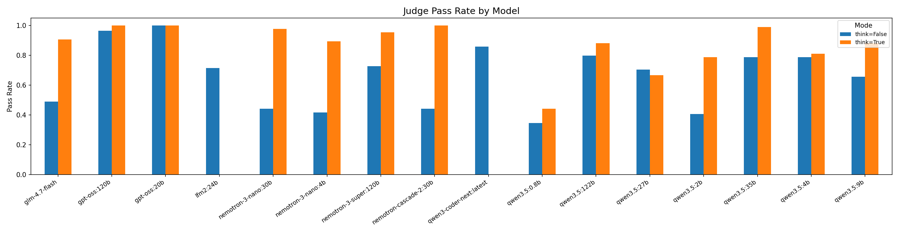
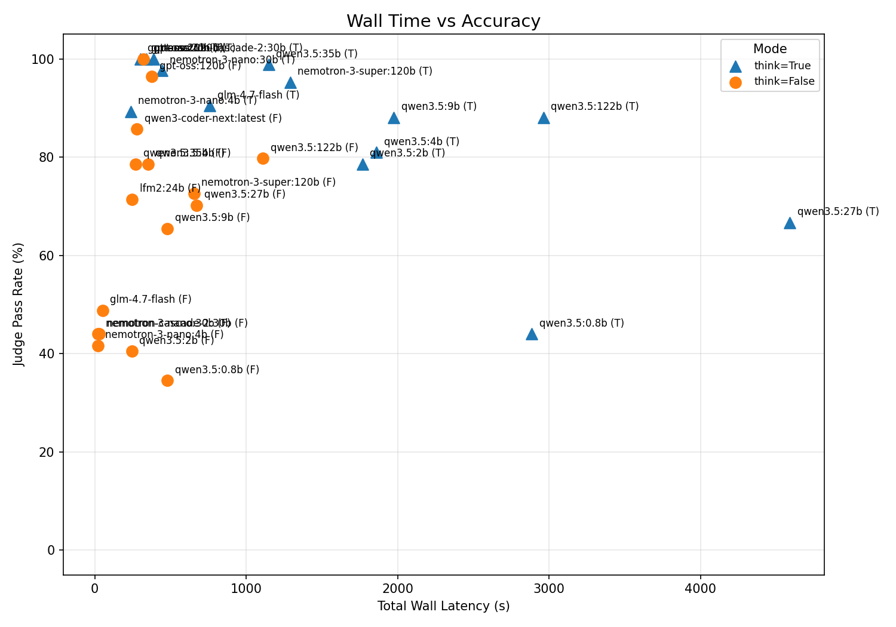
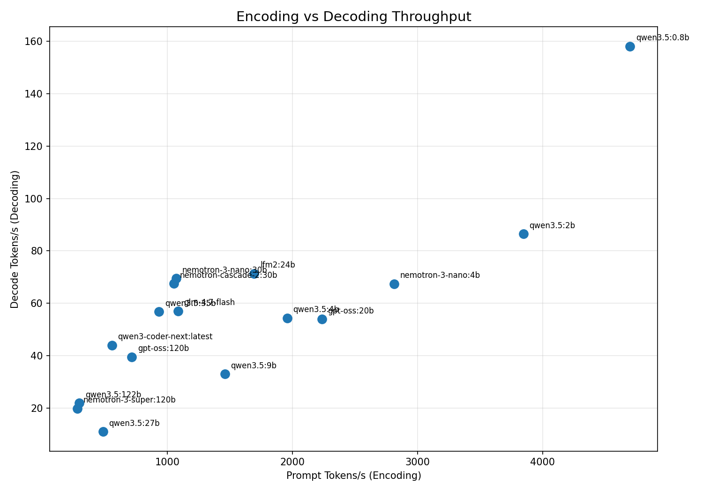
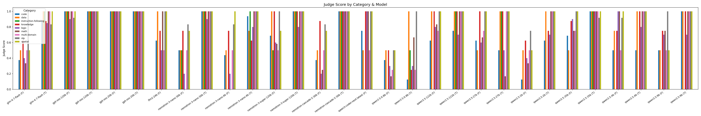

# Ollama Benchmark: Local LLM Performance on NVIDIA DGX Spark

An automated benchmarking framework that measures the real-world usability of local LLMs served by [Ollama](https://ollama.com). It evaluates models across multiple prompts and reasoning modes, collecting latency/throughput metrics and scoring answer quality via an LLM-as-a-Judge pipeline.

Built for — and tested on — the [NVIDIA DGX Spark](https://www.nvidia.com/en-us/products/workstations/dgx-spark/) (128 GB unified memory, 273 GB/s bandwidth).

## Why This Exists

Public LLM leaderboards rank models by raw capability under ideal conditions. But on local hardware, a model that fits in memory and produces correct answers *slowly* can be worse than a smaller model that runs 7x faster. This benchmark answers a different question: **which models are genuinely practical for interactive local use?**

## Quick Start

```bash
# 1. Set up Python environment
source .venv/bin/activate
pip install -r requirements.txt

# 2. Ensure Ollama is running
#    (default: localhost:11434, or set OLLAMA_HOST)

# 3. Configure models and prompts
#    Edit config.yaml

# 4. Run the benchmark
python benchmark.py

# Results are written to results/<timestamp>/
```

The benchmark is **resumable** — interrupted runs are saved to `results/wip/wip.db` (SQLite). Re-running `benchmark.py` skips already-completed combinations.

## How It Works

```
┌─────────────┐     ┌──────────────┐     ┌──────────────┐     ┌─────────────┐
│  config.yaml │────▶│  Orchestrator │────▶│  Runner      │────▶│  Judge      │
│  models,     │     │  model × mode │     │  streaming   │     │  LLM scores │
│  prompts     │     │  × prompt     │     │  HTTP to     │     │  answer vs  │
│              │     │  × run loop   │     │  Ollama API  │     │  golden     │
└─────────────┘     └──────────────┘     └──────────────┘     └─────────────┘
                           │                     │
                    ┌──────┴──────┐        ┌─────┴──────┐
                    │ Cleanup     │        │ GPU Sampler │
                    │ VRAM release│        │ nvidia-smi  │
                    │ between     │        │ every 0.5s  │
                    │ models      │        └────────────┘
                    └─────────────┘
                           │
                    ┌──────┴──────┐
                    │  Analysis   │──▶ CSVs, PNGs, leaderboards
                    └─────────────┘
```

**Per model × mode × prompt × run**, the framework:

1. **Warms up** the model with a minimal inference request
2. **Cleans up** GPU state (API unload, process kill, page cache drop)
3. **Streams** a prompt to Ollama's `/api/chat`, measuring TTFT and decode speed
4. **Judges** the response against a golden answer using a separate LLM (scoring 0.0 / 0.5 / 1.0)
5. **Persists** the result to SQLite for resumability

After all runs complete, the analysis pipeline produces:
- **Composite ranking** — weighted score (55% accuracy, 20% decode speed, 10% e2e speed, 7.5% TTFT, 7.5% wall time) with percentile normalisation
- **Category breakdown** — per-category pass rates across 9 domains
- **Charts** — accuracy, throughput scatter, wall time vs accuracy, category heatmap
- **CSVs** — raw data, summary, category summary, model ranking

## Project Structure

```
benchmark.py               Entry point
config.yaml                Models, prompts, judge config, parameters
requirements.txt            Python dependencies
ollama_benchmark/
  orchestrator.py           Main loop: model → think → prompt → run
  runner.py                 Streaming HTTP to Ollama, metrics collection
  judge.py                  LLM-as-a-Judge scoring
  gpu.py                    Background nvidia-smi sampling
  warmup.py                 Model validation before benchmarking
  cleanup.py                Multi-stage VRAM release between models
  wip.py                    SQLite-backed resumability
  analysis.py               Summary, ranking, category analysis
  display.py                Live + final leaderboards
  plots.py                  Chart generation and CSV export
  config.py                 Config loading and validation
  logging_config.py         Logging setup
results/
  <timestamp>/              Per-run output (CSVs, PNGs, REPORT.md)
  viewer.html               Interactive browser-based results viewer
  wip/wip.db                In-progress state (SQLite)
```

## Configuration

All benchmark parameters live in `config.yaml`:

| Parameter | Purpose |
|-----------|---------|
| `models` | List of Ollama model tags to benchmark |
| `prompts` | List of `{name, prompt, golden_answer}` entries |
| `runs_per_mode` | Repetitions per model/mode/prompt combination |
| `timeout_s` | Max seconds per inference run |
| `judge_model` | Model used for scoring (omit to disable judging) |
| `ollama_base_url` | Ollama endpoint (overridden by `OLLAMA_HOST` env var) |

Prompt names follow the convention `category--difficulty--short_name` (e.g. `math--easy--arithmetic`) for automatic category-level aggregation.

## Evaluation Design

**21 prompts** across **9 categories** (logic, code, math, NLP, knowledge, instruction-following, spatial, data, multi-domain) at varying difficulty levels. Every prompt:

- Includes **distractor information** to test whether models ignore noise
- Requires **JSON-formatted output** to test instruction compliance
- Has a **golden answer** for automated scoring

Each inference run has a **5-minute timeout** (`timeout_s` in config). Runs that exceed this limit are discarded and count as failures.

Each model is tested in both **think** (reasoning) and **no-think** (direct) modes.

## Key Learnings

The latest benchmark results (16 models, 30 model-mode combinations, 21 prompts) produced several findings relevant to anyone running LLMs locally on bandwidth-constrained hardware. For full details, see [`results/20260320_224129/REPORT.md`](results/20260320_224129/REPORT.md).

### MoE architecture is the decisive factor

On a single-GPU system, inference is memory-bandwidth-bound: `decode tok/s ≈ bandwidth / active_params`. MoE and cascade models keep all parameters in memory for quality but only read active experts per token. A 30B MoE with 3.6B active params runs at 69 tok/s — while a 27B dense model crawls at 11 tok/s. Nemotron Cascade 2 30B takes this further with a cascade architecture, achieving 100% accuracy at 66.8 tok/s. **Total parameter count is meaningless; active parameter count determines speed.**

### Think mode transforms quality

Enabling reasoning averages **+24 percentage points** across all models. The gains are largest for fast MoE and cascade models with weak "System 1" responses:

| Model | No-Think | Think | Delta |
|-------|:--------:|:-----:|:-----:|
| Nemotron Cascade 2 30B | 44% | 100% | +56 pp |
| Nemotron 3 Nano 30B | 44% | 98% | +54 pp |
| GLM-4.7-Flash | 49% | 90% | +42 pp |

A 4B MoE with thinking beats a 122B model without it.

### Cloud leaderboard rankings invert locally

The model with the highest cloud intelligence index (Qwen3.5:27b, AA Index 42) is the **worst** local performer (rank 30/30). The model with the lowest index (Nemotron 3 Nano 30B, AA Index 13) ranks **#2** (rank 2/30). Memory bandwidth constraints completely reshape the quality-speed trade-off.

### Small MoE models match cloud API speed

For Nemotron 3 Nano 30B and GLM-4.7-Flash, the DGX Spark runs within **1.1–1.2x** of cloud API throughput — effectively API-competitive at zero per-token cost with full data privacy.

### 120B models can work — if they're MoE

Dense 120B+ models suffer 20–30s TTFT and are impractical. But gpt-oss:120b (likely MoE with ~7B active params) achieves 100% accuracy, 40 tok/s, and 0.58s TTFT — fully interactive despite its size.

### Top recommendations

| Model | Accuracy | Decode | Best For |
|-------|:--------:|:------:|----------|
| nemotron-cascade-2:30b (think) | 100% | 66.8 tok/s | Perfect accuracy at top speed — new #1 overall |
| nemotron-3-nano:30b (think) | 97.6% | 69 tok/s | Fastest high-quality all-rounder |
| gpt-oss:20b (no-think) | 100% | 55 tok/s | Perfect accuracy, no reasoning overhead |
| qwen3.5:35b (think) | 98.8% | 56 tok/s | Hardest tasks (100% logic, code, math) |
| gpt-oss:120b (think) | 100% | 40 tok/s | Perfect scores on all 9 categories |

## Latest Results

Benchmark run from 2026-03-20: 16 models, 30 model-mode combinations, 21 prompts across 9 categories, 2 runs per combination. All values are means across runs. For the full analysis, see [`REPORT.md`](results/20260320_224129/REPORT.md).

### Composite Leaderboard

All 30 model × mode combinations, ranked by weighted composite score (55% accuracy, 20% decode speed, 10% e2e speed, 7.5% TTFT, 7.5% wall time):

| Rank | Model | Think | Pass Rate | Decode (tok/s) | E2E (tok/s) | TTFT (s) | Wall (s) | Composite |
|-----:|-------|:-----:|----------:|---------------:|------------:|---------:|---------:|----------:|
| 1 | nemotron-cascade-2:30b | Yes | 100.0% | 66.8 | 64.0 | 0.31 | 18.5 | 0.811 |
| 2 | nemotron-3-nano:30b | Yes | 97.6% | 69.0 | 66.0 | 0.30 | 21.2 | 0.784 |
| 3 | gpt-oss:20b | No | 100.0% | 55.2 | 53.0 | 0.33 | 15.3 | 0.768 |
| 4 | gpt-oss:20b | Yes | 100.0% | 52.7 | 50.4 | 0.33 | 14.3 | 0.739 |
| 5 | nemotron-3-nano:4b | Yes | 89.3% | 66.5 | 64.0 | 0.19 | 11.2 | 0.721 |
| 6 | qwen3.5:35b | Yes | 98.8% | 56.4 | 54.9 | 0.37 | 54.7 | 0.701 |
| 7 | gpt-oss:120b | Yes | 100.0% | 40.0 | 37.6 | 0.58 | 16.1 | 0.680 |
| 8 | glm-4.7-flash | Yes | 90.5% | 55.0 | 53.7 | 0.29 | 36.2 | 0.634 |
| 9 | qwen3.5:2b | Yes | 78.6% | 85.3 | 83.0 | 0.19 | 84.2 | 0.599 |
| 10 | lfm2:24b | No | 71.4% | 71.4 | 64.2 | 0.18 | 11.8 | 0.579 |
| 11 | gpt-oss:120b | No | 96.4% | 39.2 | 37.0 | 0.60 | 18.0 | 0.573 |
| 12 | qwen3.5:4b | Yes | 81.0% | 53.8 | 52.8 | 0.25 | 88.6 | 0.516 |
| 13 | qwen3-coder-next | No | 85.7% | 44.1 | 37.0 | 0.45 | 13.3 | 0.497 |
| 14 | qwen3.5:4b | No | 78.6% | 54.9 | 46.5 | 0.25 | 16.9 | 0.491 |
| 15 | qwen3.5:35b | No | 78.6% | 57.3 | 43.1 | 0.37 | 12.9 | 0.485 |
| 16 | qwen3.5:9b | Yes | 88.1% | 34.0 | 33.6 | 0.28 | 94.0 | 0.485 |
| 17 | nemotron-3-super:120b | Yes | 95.2% | 19.8 | 10.9 | 22.0 | 61.4 | 0.466 |
| 18 | qwen3.5:0.8b | Yes | 44.0% | 156.6 | 148.2 | 0.29 | 137.4 | 0.426 |
| 19 | qwen3.5:2b | No | 40.5% | 87.7 | 64.3 | 0.20 | 11.7 | 0.416 |
| 20 | qwen3.5:0.8b | No | 34.5% | 159.2 | 121.3 | 0.18 | 22.8 | 0.403 |
| 21 | qwen3.5:122b | Yes | 88.1% | 21.8 | 16.5 | 26.9 | 141.1 | 0.401 |
| 22 | nemotron-3-nano:30b | No | 44.0% | 70.1 | 44.9 | 0.31 | 1.1 | 0.395 |
| 23 | glm-4.7-flash | No | 48.8% | 59.1 | 42.6 | 0.30 | 2.4 | 0.384 |
| 24 | nemotron-3-nano:4b | No | 41.7% | 68.4 | 49.2 | 0.19 | 1.0 | 0.384 |
| 25 | nemotron-cascade-2:30b | No | 44.0% | 68.4 | 45.2 | 0.31 | 1.4 | 0.378 |
| 26 | qwen3.5:122b | No | 79.8% | 22.2 | 3.9 | 30.8 | 52.9 | 0.340 |
| 27 | qwen3.5:9b | No | 65.5% | 32.2 | 27.2 | 0.29 | 22.8 | 0.275 |
| 28 | nemotron-3-super:120b | No | 72.6% | 20.0 | 5.6 | 21.6 | 31.1 | 0.269 |
| 29 | qwen3.5:27b | No | 70.2% | 11.2 | 9.9 | 0.55 | 32.0 | 0.228 |
| 30 | qwen3.5:27b | Yes | 66.7% | 10.9 | 10.8 | 0.61 | 218.5 | 0.172 |

### Charts










## Disclaimer

Benchmark results are provided "as is" without warranty of any kind. Results may vary depending on hardware configuration, software versions, model quantisation, thermal conditions, and system load. No guarantee of accuracy or reproducibility is made.

Mention of specific models, vendors, or products does not imply endorsement or affiliation. The authors are not liable for any decisions or outcomes based on these results.

See [LICENSE](LICENSE) for the full terms.

## License

MIT License — see [LICENSE](LICENSE).
