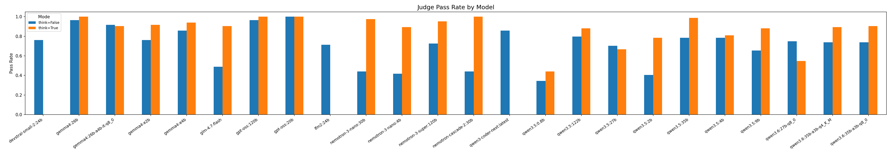
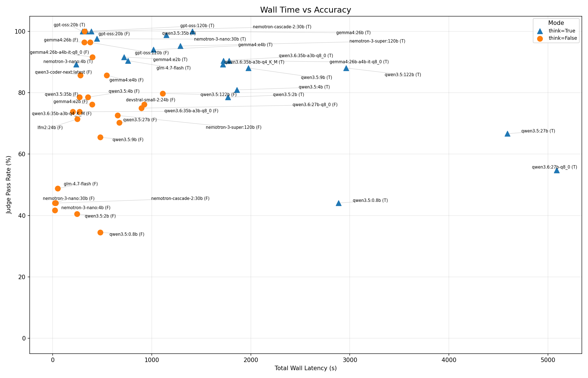
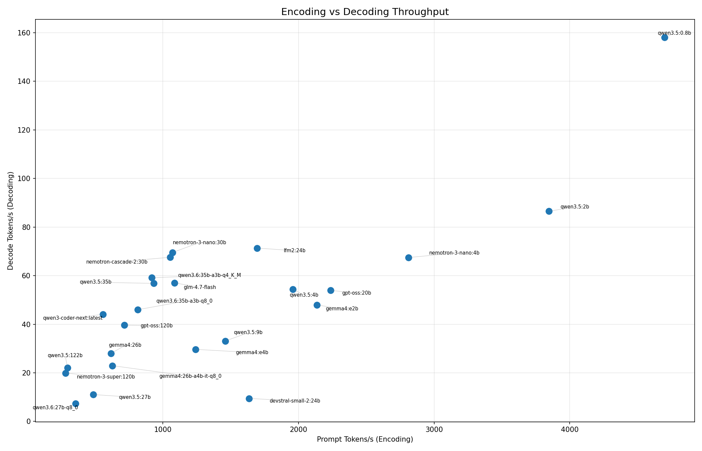
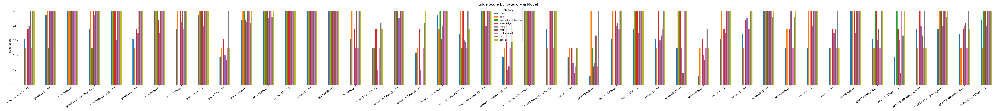

# Benchmark Report: Local LLM Inference on NVIDIA DGX Spark

**Date**: 2026-05-04
**Benchmark run**: `results/20260504_031837/`

---

## 1. Executive Summary

This benchmark measured 24 configured models (22 successfully ran, producing 45 model-mode combinations) across 21 prompts on the NVIDIA DGX Spark (128 GB unified memory, 273 GB/s bandwidth). Three new Qwen3.6 variants were added since the 2026-04-07 run.

**Key findings:**

1. **Top 4 unchanged from previous run.** gpt-oss:20b (think and no-think), gpt-oss:120b (think) and nemotron-cascade-2:30b (think) continue to occupy ranks 1-4 with identical composite scores. The ceiling at the top has not moved.

2. **The new Qwen3.6:35b-a3b MoE variants are mid-tier.** Both `qwen3.6:35b-a3b-q4_K_M` (60 tok/s) and `qwen3.6:35b-a3b-q8_0` (46 tok/s) reach 90% pass rate with thinking but cluster around composite 0.47-0.51 -- solid, but well below the gpt-oss family. The q4 variant beats the q8 variant on speed without losing measurable quality, making q4 the better choice on this hardware.

3. **`qwen3.6:27b-q8_0` is a misfit on DGX Spark.** Decode throughput collapses to 7.3 tok/s (vs 11 tok/s for the dense qwen3.5:27b at the same nominal size). With thinking enabled it accumulates 9 timeouts and a wall sum of 5,088 s, taking last place at composite 0.10. Recommend dropping it from `config.yaml`.

4. **Think-mode quality gains preserved.** The cascade and nano models still post +56 / +54 / +48 pp gains with thinking, validating reasoning as the primary lever for MoE quality.

**Top 3 recommendations (unchanged):**

| Model | Why |
|-------|-----|
| **gpt-oss:20b** (think) | 100% accuracy, 14.3 s wall, fastest overall |
| **gpt-oss:120b** (think) | 100% accuracy, viable 120B MoE at 40 tok/s |
| **nemotron-cascade-2:30b** (think) | 100% accuracy, 66.8 tok/s decode |

---

## 2. Hardware & Test Setup

### Hardware: NVIDIA DGX Spark

| Spec | Value |
|------|-------|
| SoC | NVIDIA GB10 (Blackwell GPU + Grace ARM CPU) |
| Memory | 128 GB LPDDR5x unified (CPU + GPU shared) |
| Memory bandwidth | 273 GB/s |
| CUDA cores | 6,144 |
| CPU | 20-core NVIDIA Grace (ARM) |

### Software Stack

| Component | Configuration |
|-----------|---------------|
| Inference server | [Ollama](https://ollama.com) |
| KV cache quantization | `OLLAMA_KV_CACHE_TYPE=q8` |
| Flash attention | `OLLAMA_FLASH_ATTENTION=true` |
| Parallel requests | `OLLAMA_NUM_PARALLEL=2` |
| Model format | GGUF (Ollama default quantization per model tag) |

### Benchmark Configuration

| Parameter | Value |
|-----------|-------|
| Models configured | 24 (22 successfully ran; `lfm2:24b` and `qwen3-coder-next:latest` skip think mode) |
| New since last run | `qwen3.6:27b-q8_0`, `qwen3.6:35b-a3b-q4_K_M`, `qwen3.6:35b-a3b-q8_0` |
| Prompts | 21 across 9 categories |
| Runs per mode | 2 |
| Timeout | 300 seconds per run |
| Judge model | `qwen3.5:35b` (temperature 0.1, no-think mode) |
| Judge scoring | 0.0 (fail), 0.5 (partial), 1.0 (pass) |

---

## 3. Composite Score

The ranking uses a weighted composite with rank-based (percentile) normalisation across two user-facing dimensions:

| Metric | Weight | Direction |
|--------|--------|-----------|
| Judge pass rate (quality) | 65% | Higher is better |
| Wall latency (speed) | 35% | Lower is better |

Wall time captures the full user experience including TTFT, decode speed, and output length. Rank-based normalisation eliminates sensitivity to outliers.

---

## 4. Results Overview

### Full Ranking

All 45 model x mode combinations, sorted by composite score:

| Rank | Model | Think | Pass Rate | Decode (tok/s) | TTFT (s) | Wall (s) | Composite |
|-----:|-------|:-----:|----------:|---------------:|---------:|---------:|----------:|
| 1 | gpt-oss:20b | Yes | 100.0% | 52.7 | 0.33 | 14.3 | 0.883 |
| 2 | gpt-oss:20b | No | 100.0% | 55.2 | 0.33 | 15.3 | 0.867 |
| 3 | gpt-oss:120b | Yes | 100.0% | 40.0 | 0.58 | 16.1 | 0.859 |
| 4 | nemotron-cascade-2:30b | Yes | 100.0% | 66.8 | 0.31 | 18.5 | 0.835 |
| 5 | gemma4:26b | No | 96.4% | 28.3 | 1.26 | 15.2 | 0.794 |
| 6 | gpt-oss:120b | No | 96.4% | 39.2 | 0.60 | 18.0 | 0.762 |
| 7 | nemotron-3-nano:30b | Yes | 97.6% | 69.0 | 0.30 | 21.2 | 0.752 |
| 8 | nemotron-3-nano:4b | Yes | 89.3% | 66.5 | 0.19 | 11.2 | 0.716 |
| 9 | gemma4:26b | Yes | 100.0% | 27.6 | 1.14 | 67.1 | 0.700 |
| 10 | gemma4:26b-a4b-it-q8_0 | No | 91.7% | 23.1 | 1.36 | 19.1 | 0.679 |
| 11 | qwen3.5:35b | Yes | 98.8% | 56.4 | 0.37 | 54.7 | 0.672 |
| 12 | gemma4:e2b | Yes | 91.7% | 48.3 | 0.86 | 34.2 | 0.623 |
| 13 | qwen3-coder-next:latest | No | 85.7% | 44.1 | 0.45 | 13.3 | 0.618 |
| 14 | gemma4:e4b | Yes | 94.0% | 29.1 | 1.00 | 48.4 | 0.614 |
| 15 | nemotron-3-super:120b | Yes | 95.2% | 19.8 | 21.96 | 61.4 | 0.605 |
| 16 | glm-4.7-flash | Yes | 90.5% | 55.0 | 0.29 | 36.2 | 0.578 |
| 17 | qwen3.5:35b | No | 78.6% | 57.3 | 0.37 | 12.9 | 0.559 |
| 18 | **qwen3.6:35b-a3b-q4_K_M** | No | 73.8% | 59.6 | 0.36 | 9.7 | 0.518 |
| 19 | gemma4:e4b | No | 85.7% | 30.2 | 0.90 | 26.0 | 0.514 |
| 20 | qwen3.5:4b | No | 78.6% | 54.9 | 0.25 | 16.9 | 0.511 |
| 21 | **qwen3.6:35b-a3b-q8_0** | Yes | 90.5% | 45.8 | 0.40 | 82.1 | 0.507 |
| 22 | gemma4:26b-a4b-it-q8_0 | Yes | 90.5% | 22.8 | 1.21 | 84.7 | 0.491 |
| 23 | **qwen3.6:35b-a3b-q4_K_M** | Yes | 89.3% | 58.6 | 0.37 | 81.8 | 0.478 |
| 24 | **qwen3.6:35b-a3b-q8_0** | No | 73.8% | 46.1 | 0.39 | 12.9 | 0.486 |
| 25 | lfm2:24b | No | 71.4% | 71.4 | 0.18 | 11.8 | 0.457 |
| 26 | gemma4:e2b | No | 76.2% | 47.6 | 0.87 | 18.9 | 0.451 |
| 27 | glm-4.7-flash | No | 48.8% | 59.1 | 0.30 | 2.4 | 0.415 |
| 28 | qwen3.5:122b | No | 79.8% | 22.2 | 30.77 | 52.9 | 0.414 |
| 29 | qwen3.5:9b | Yes | 88.1% | 34.0 | 0.28 | 94.0 | 0.409 |
| 30 | nemotron-3-nano:30b | No | 44.0% | 70.1 | 0.31 | 1.1 | 0.401 |
| 31 | nemotron-cascade-2:30b | No | 44.0% | 68.4 | 0.31 | 1.4 | 0.393 |
| 32 | qwen3.5:122b | Yes | 88.1% | 21.8 | 26.86 | 141.1 | 0.393 |
| 33 | nemotron-3-nano:4b | No | 41.7% | 68.4 | 0.19 | 1.0 | 0.380 |
| 34 | qwen3.5:4b | Yes | 81.0% | 53.8 | 0.25 | 88.6 | 0.365 |
| 35 | devstral-small-2:24b | No | 76.2% | 9.5 | 1.03 | 44.0 | 0.363 |
| 36 | **qwen3.6:27b-q8_0** | No | 75.0% | 7.4 | 0.70 | 42.6 | 0.349 |
| 37 | qwen3.5:2b | Yes | 78.6% | 85.3 | 0.19 | 84.2 | 0.336 |
| 38 | nemotron-3-super:120b | No | 72.6% | 20.0 | 21.56 | 31.1 | 0.336 |
| 39 | qwen3.5:2b | No | 40.5% | 87.7 | 0.20 | 11.7 | 0.317 |
| 40 | qwen3.5:27b | No | 70.2% | 11.2 | 0.55 | 32.0 | 0.299 |
| 41 | qwen3.5:9b | No | 65.5% | 32.2 | 0.29 | 22.8 | 0.293 |
| 42 | qwen3.5:0.8b | No | 34.5% | 159.2 | 0.18 | 22.8 | 0.183 |
| 43 | qwen3.5:27b | Yes | 66.7% | 10.9 | 0.61 | 218.5 | 0.141 |
| 44 | **qwen3.6:27b-q8_0** | Yes | 54.8% | 7.3 | 0.93 | 242.3 | 0.103 |
| 45 | qwen3.5:0.8b | Yes | 44.0% | 156.6 | 0.29 | 137.4 | 0.083 |

**Bold** rows mark models added since the 2026-04-07 run.

### Charts

---

## 5. Focus: New Qwen3.6 Variants

### qwen3.6:35b-a3b-q4_K_M and q8_0 (MoE, ~3B active)

Both quantizations of the 35B-a3b MoE were tested side-by-side:

| Quant | Think | Pass Rate | Decode (tok/s) | Wall (s) | Composite |
|-------|:-----:|----------:|---------------:|---------:|----------:|
| q4_K_M | No | 73.8% | **59.6** | 9.7 | 0.518 |
| q4_K_M | Yes | 89.3% | **58.6** | 81.8 | 0.478 |
| q8_0 | No | 73.8% | 46.1 | 12.9 | 0.486 |
| q8_0 | Yes | 90.5% | 45.8 | 82.1 | 0.507 |

**Quality is essentially identical between q4 and q8** (74% vs 74% no-think; 89% vs 91% think -- a single judge call delta). **Speed differs by ~30%** in q4's favour because q4 reads less memory per token. On a bandwidth-bound system, q4 is the better default for this MoE -- the q8 weight precision buys nothing measurable on this benchmark.

Both variants land in the middle of the leaderboard. They cannot match the gpt-oss family or the nemotron MoEs at the top, but they are competitive with `qwen3.5:35b` (which they replace in some workflows): roughly equal think-mode quality (89-91% vs 99%) but at higher decode speed (59 tok/s vs 56 tok/s) and similar wall time.

### qwen3.6:27b-q8_0 (dense, 27B at q8)

This variant is the run's clear failure case:

| Metric | Value | Comparison |
|--------|------:|------------|
| Decode (tok/s) | 7.3 | qwen3.5:27b: 11.2 (dense, same nominal size) |
| Wall (think, sum) | 5,088 s | nemotron-cascade-2:30b: 388 s |
| Think-mode timeouts | 9 / 21 prompts | gpt-oss:20b: 0 |
| Think-mode pass rate | 54.8% | qwen3.5:27b think: 66.7% |
| Composite (think) | 0.103 | rank 44 of 45 |

The likely cause is the q8 quantization tipping the model into partial CPU offload on 128 GB unified memory under realistic concurrency, since `qwen3.5:27b` (also dense, also at default Ollama quant) runs ~50% faster. Removing this entry from `config.yaml` would save roughly 1.5 hours of benchmark time.

---

## 6. Lessons Learned

### 1. The top 4 is stable

Three Qwen3.6 variants entered the field; none broke the top 10. The composite ceiling is held by gpt-oss:20b at 0.88, exactly as in the previous run. Local-LLM quality at the top is becoming a saturated problem at this benchmark's difficulty level.

### 2. Quantization choice matters more than weight precision

The q4 vs q8 comparison on the same `qwen3.6:35b-a3b` architecture shows that on a bandwidth-bound system, the lower-precision variant wins outright -- same quality, ~30% more throughput. The default assumption "q8 is safer" should be inverted for MoE on DGX Spark.

### 3. New dense quants need a smoke test before benchmarking

`qwen3.6:27b-q8_0` consumed disproportionate benchmark wall-clock time (~1.5 h of the ~3.5 h total run) for results that ranked 44/45. A 1-prompt smoke run before adding a model to the suite would catch pathologically slow configurations.

### 4. Composite ranking remains stable across runs

Despite three new entries and one rerun, ranks 1-9 are identical between 2026-04-07 and 2026-05-04. The composite score is reproducible and not sensitive to small membership changes -- evidence the percentile-rank normalisation is doing its job.

---

## 7. Recommendations

### Tier 1 -- Daily Drivers (unchanged)

| Model | Pass Rate | Decode (tok/s) | Wall (s) | Composite | Best For |
|-------|---:|---:|---:|---:|---|
| **gpt-oss:20b** (think) | 100% | 52.7 | 14.3 | 0.883 | Best overall |
| **gpt-oss:20b** (no-think) | 100% | 55.2 | 15.3 | 0.867 | Perfect without reasoning overhead |
| **gpt-oss:120b** (think) | 100% | 40.0 | 16.1 | 0.859 | Largest viable MoE |
| **nemotron-cascade-2:30b** (think) | 100% | 66.8 | 18.5 | 0.835 | Highest decode at perfect accuracy |

### Tier 2 -- Strong Alternatives

| Model | Pass Rate | Decode (tok/s) | Wall (s) | Composite | Best For |
|-------|---:|---:|---:|---:|---|
| **gemma4:26b** (no-think) | 96.4% | 28.3 | 15.2 | 0.794 | Dense, fast, near-perfect |
| **nemotron-3-nano:30b** (think) | 97.6% | 69.0 | 21.2 | 0.752 | Fastest decode at near-perfect quality |
| **nemotron-3-nano:4b** (think) | 89.3% | 66.5 | 11.2 | 0.716 | Lowest latency option |
| **qwen3.6:35b-a3b-q4_K_M** (think) | 89.3% | 58.6 | 81.8 | 0.478 | Newer MoE; prefer q4 over q8 |

### Tier 3 -- Drop or Replace

| Model | Issue |
|-------|-------|
| **qwen3.6:27b-q8_0** | 7.3 tok/s, 9 timeouts in think mode -- remove from config |
| **qwen3.5:27b** (think) | 11 tok/s, 219 s wall -- composite 0.14 |
| **qwen3.5:122b**, **nemotron-3-super:120b** | 20-22 tok/s with multi-second TTFT |
| **qwen3.5:0.8b** | 157 tok/s but 35-44% accuracy -- too inaccurate to be useful |

---

## Appendix: Data Sources

- **Benchmark data:** `results/20260504_031837/` (ranking CSV, category summary CSV, summary CSV, raw CSV)
- **Benchmark configuration:** `config.yaml`
- **Ollama configuration:** `ollama_settings/ollama.service`
